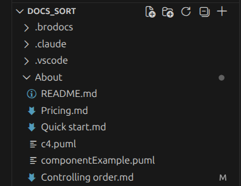

# Controlling order

By default, items in each directory appear in natural sort order, with directories listed before files. There are two ways to change the order — pick the one that fits your workflow.


## Option 1: Order files

Create a plain text file named `order` in any directory. List the items that should appear first, one per line:

```plain
README.md
Quick start.md
```

The listed items come first in the exact order given. Everything else follows in natural sort order. Create a separate `order` file in each directory you want to customize.

This approach works well when docs are generated from code or with an LLM — it is simple, predictable, and easy to produce programmatically.


## Option 2: Explorer Sort VS Code plugin (visual, drag-and-drop)

If you write docs in VS Code, the [Explorer Sort](https://github.com/Jinchanghyeok/explorer-sort) extension lets you reorder files and folders by dragging them in the file explorer panel — the same way you would reorder items in any list. What you see in VS Code is what you get in the published site.



**Setup:**

1. Install the Explorer Sort extension from the VS Code Marketplace.
2. Open your docs repository in VS Code.
3. Drag files and folders in the Explorer panel into the order you want.

The extension saves the order to `.vscode/settings.json` in your repository. Brodocs reads this file automatically during site generation, so the published left menu reflects your visual arrangement without any manual editing.

**When to use this option:** When you prefer a visual interface over editing text files, and you are already working in VS Code.
